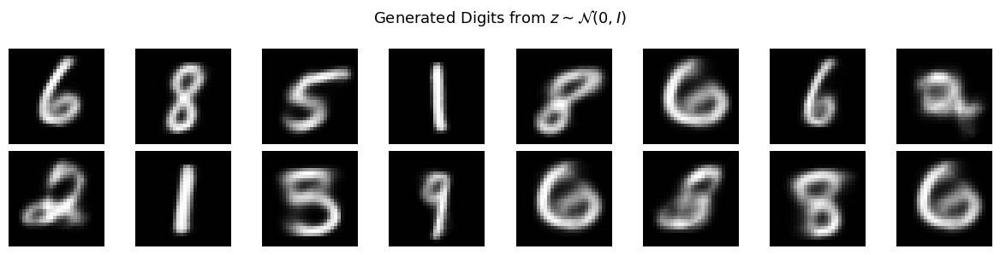
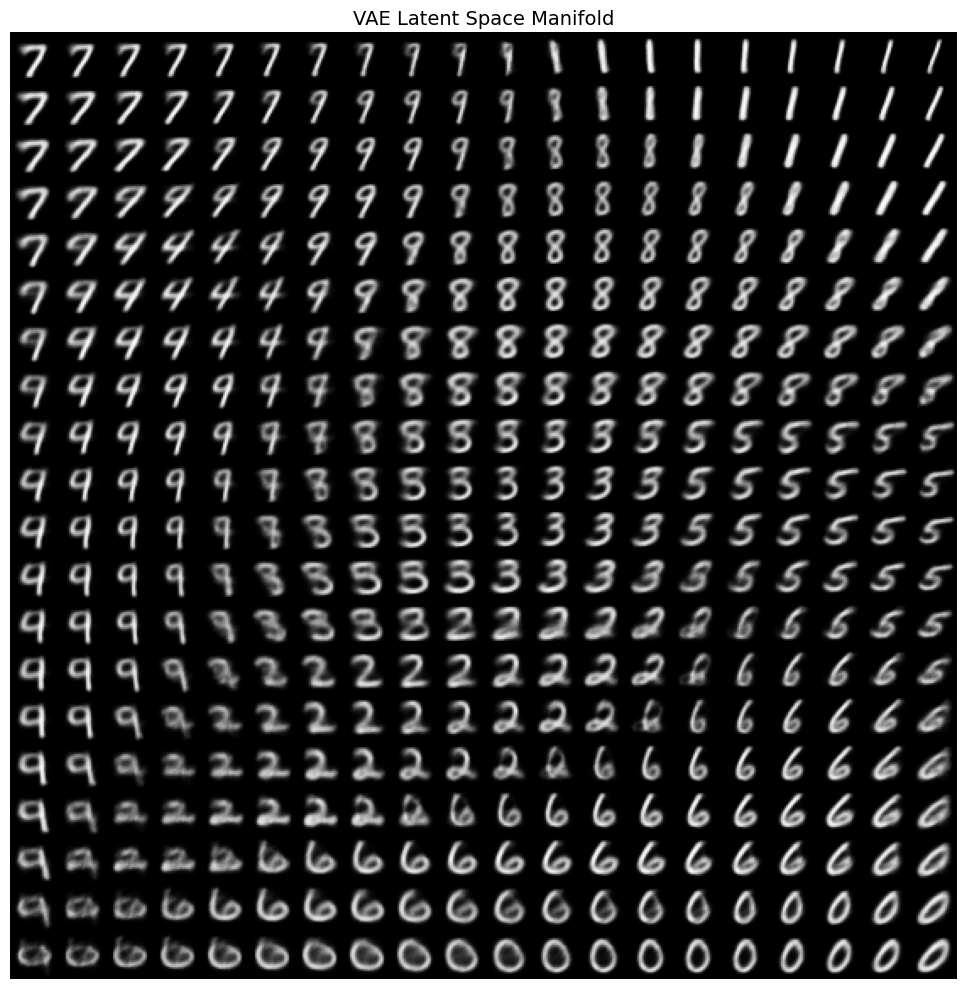

# Variational Autoencoder (VAE)

Basic implementation of a Variational Autoencoder for Image Generation, trained on the MNIST handwritten digit dataset.

---

| Generated Digits | Latent Space Manifold |
|:---:|:---:|
|  |  |
| Samples from $z \sim \mathcal{N}(0, I)$ | 2D grid sweep of the latent space |

## Overview

A VAE learns a **compressed latent representation** $z$ of data $x$ by jointly training an encoder and a decoder. Unlike a standard autoencoder, the encoder outputs a *distribution* over the latent space rather than a single point — this forces the latent space to be continuous and structured, enabling generation of new samples.

The model is trained by maximizing the **Evidence Lower Bound (ELBO)**:

$$
\mathcal{L}(\theta, \phi;\, x) = \mathbb{E}_{q_\phi(z|x)}[\log p_\theta(x|z)] - D_{KL}(q_\phi(z|x) \| p(z))
$$

| Term | Role |
|---|---|
| $\mathbb{E}[\log p_\theta(x \| z)]$ | Reconstruction — decoder should reproduce the input |
| $D_{KL}(q_\phi \| p)$ | Regularization — keep the latent distribution close to $\mathcal{N}(0, I)$ |

---

## Model Architecture

```
Input x (784)
     │
  ┌──▼──────────────────┐
  │  Encoder            │
  │  Linear(784 → 512)  │
  │  ReLU               │
  │  Linear(512 → 512)  │
  │  ReLU               │
  └──┬──────────────┬───┘
     │              │
  fc_mu(2)    fc_log_var(2)
     │              │
     └──── z = μ + σ⊙ε ────  Reparameterization
                │
  ┌─────────────▼───────────┐
  │  Decoder                │
  │  Linear(2 → 512)        │
  │  ReLU                   │
  │  Linear(512 → 512)      │
  │  ReLU                   │
  │  Linear(512 → 784)      │
  │  Sigmoid                │
  └─────────────┬───────────┘
         Output x̂ (784)
```

### Encoder

Maps input $x$ to parameters of a Gaussian posterior:

$$
q_\phi(z|x) = \mathcal{N}\!\left(z;\, \mu_\phi(x),\, \text{diag}(\sigma_\phi^2(x))\right)
$$

```python
self.encoder = nn.Sequential(
    nn.Linear(input_dim, hidden_dim), nn.ReLU(),
    nn.Linear(hidden_dim, hidden_dim), nn.ReLU(),
)
self.fc_mu      = nn.Linear(hidden_dim, latent_dim)
self.fc_log_var = nn.Linear(hidden_dim, latent_dim)
```

### Reparameterization Trick

Allows gradients to flow through the sampling step:

$$z = \mu + \sigma \odot \epsilon, \quad \epsilon \sim \mathcal{N}(0, I)$$

```python
def reparameterize(self, mu, log_var):
    std = torch.exp(0.5 * log_var)
    eps = torch.randn_like(std)
    return mu + std * eps
```

### Decoder

Reconstructs $x$ from $z$. Each pixel is modelled as an independent Bernoulli (pixels are near-binary after `ToTensor()`):

$$p_\theta(x|z) = \prod_{i=1}^{784} \text{Bernoulli}(x_i;\, \hat{x}_i(z))$$

```python
self.decoder = nn.Sequential(
    nn.Linear(latent_dim, hidden_dim), nn.ReLU(),
    nn.Linear(hidden_dim, hidden_dim), nn.ReLU(),
    nn.Linear(hidden_dim, input_dim),
    nn.Sigmoid(),
)
```

---

## Loss Function

### Reconstruction Loss (Binary Cross-Entropy)

$$\mathcal{L}_{\text{recon}} = -\sum_{i=1}^{784} \Big[ x_i \log \hat{x}_i + (1 - x_i) \log(1 - \hat{x}_i) \Big]$$

### KL Divergence

Closed-form solution between $\mathcal{N}(\mu, \sigma^2)$ and $\mathcal{N}(0, I)$:

$$D_{KL} = -\frac{1}{2} \sum_{j=1}^{d_z} \Big(1 + \log \sigma_j^2 - \mu_j^2 - \sigma_j^2 \Big)$$

```python
def vae_loss(x_recon, x, mu, log_var):
    recon_loss = F.binary_cross_entropy(x_recon, x, reduction="sum")
    kl_loss    = -0.5 * torch.sum(1 + log_var - mu.pow(2) - log_var.exp())
    return (recon_loss + kl_loss) / x.size(0)
```

---

## Generation

After training, new digits are generated by sampling directly from the prior and decoding:

$$z \sim \mathcal{N}(0, I), \quad \hat{x} = \text{Decoder}_\theta(z)$$

```python
z_samples = torch.randn(num_samples, LATENT_DIM).to(device)
generated  = model.decode(z_samples)
```


---

## Latent Space Manifold

With `LATENT_DIM = 2`, we can sweep the full latent space on a 2D grid. Points are spaced by quantiles of $\mathcal{N}(0,1)$ using the inverse CDF $\Phi^{-1}$ for uniform probability coverage:

$$z_j = \Phi^{-1}(u_j), \quad u_j \in \{0.05, 0.10, \ldots, 0.95\}$$

```python
from scipy.stats import norm

grid = norm.ppf(np.linspace(0.05, 0.95, n))
for yi in grid:
    for xi in grid:
        z = torch.tensor([[xi, yi]])
        digit = model.decode(z)
```


Each cell in the grid is a decoded image — the smooth transitions show that the VAE has learned a continuous, semantically organized latent space.